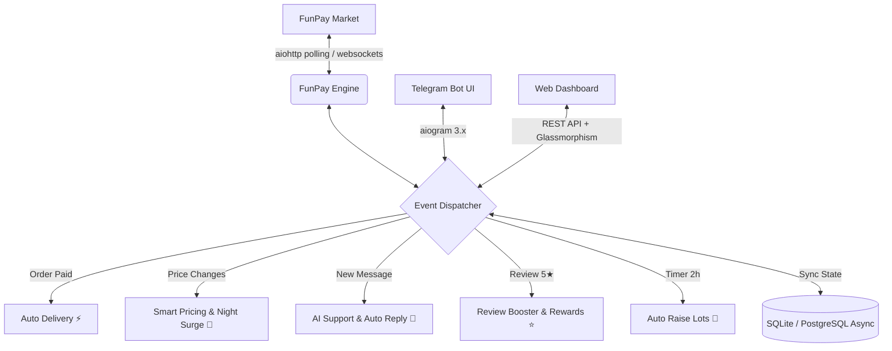

# 💎 PrimeFunPay — Enterprise Multi-User Automation & Sales Acceleration Platform for FunPay

<p align="center">
  
  
  
  
  
  
</p>

---

## 📌 О проекте (Project Overview)

**PrimeFunPay** — это современная высоконагруженная асинхронная экосистема для полной автоматизации e-commerce торговли на маркетплейсе **FunPay** с мульти-пользовательской поддержкой (Multi-Tenant SaaS), веб-дашбордом в реальном времени, 24-часовой аналитикой конкурентов, умным ночным ценообразованием (Night Surge) и защитой сессий.

Проект разработан по принципам чистой архитектуры (Clean Architecture), полностью асинхронен (`asyncio`, `aiohttp`, `SQLAlchemy 2.0 Async`) и готов к мгновенному деплою в Docker и облачные платформы (Render, Linux VPS, Kubernetes).

---

## ⚡ Ключевые возможности (Key Features)



### 1. 👥 Мульти-пользовательская SaaS-архитектура (Multi-Tenant Architecture)
- Любой пользователь Telegram может написать боту `/start` и подключить свой собственный FunPay аккаунт через `golden_key`.
- Индивидуальные настройки для каждого продавца: автовыдача, свои товары, персональные прокси, статистика и управление.

### 2. 🌙 Ночной Surge Pricing (+15%...30% чистой прибыли)
- Автоматически повышает цены в ночное время (23:00 - 07:00 MSK), когда конкуренты спят, а покупатели ищут мгновенную автовыдачу.
- Автоматически возвращает дневные цены утром.

### 3. ⭐ Авто-буст 5★ отзывов с кэшбэком (Review Booster)
- Через 5 минут после покупки бот отправляет покупателю напоминание о подтверждении заказа с мотивацией за 5★ отзыв.
- При получении 5★ отзыва бот автоматически отправляет покупателю промокод / бонусный подарок прямо в чат FunPay.

### 4. 📊 24-часовая аналитика рынка и трендов (Market Intelligence)
- Автоматический парсинг категорий FunPay за 24 часа.
- Вычисление медианной, минимальной и рекомендованной цены, уровня спроса и кликабельных прямых ссылок на топ-3 продаваемых лотов конкурентов.

### 5. 🔄 Авто-мониторинг сессии (Session Health Guard)
- Фоновая проверка жизнеспособности сессии каждые 3 минуты.
- При сбросе cookie мгновенно присылает тревожное push-уведомление в Telegram с кнопкой для ввода нового ключа в 1 клик.

### 6. 🌐 Интерактивный Web-Dashboard & REST API
- Панель управления на темной теме (Glassmorphism UI) с живыми графиками доходов, топ-товарами, остатками на складе и логами.

### 7. 💬 Telegram Чат-Центр
- Пересылка входящих сообщений покупателей в Telegram.
- Ответ покупателю прямо через обычный **Reply** на сообщение в Telegram.

---

## 🛠️ Технологический стек (Tech Stack)

| Компонент | Технологии |
|---|---|
| **Core & Concurrency** | Python 3.11+, `asyncio`, non-blocking I/O loop |
| **HTTP Engine** | `aiohttp`, `BeautifulSoup4`, `lxml` |
| **Telegram Bot** | `aiogram 3.x`, FSM (Finite State Machine), Inline Keyboards |
| **Database & ORM** | `SQLAlchemy 2.0 (Async)`, `aiosqlite`, SQLite, PostgreSQL-ready |
| **Web Dashboard** | Vanilla Modern JavaScript (ES6+), CSS3 Glassmorphism, Chart.js |
| **DevOps & Cloud** | Docker, Docker Compose, systemd, Render.com, GitHub Actions |
| **Quality & Tests** | `pytest`, `pytest-asyncio`, Clean Code architecture |

---

## 📂 Архитектура и структура каталогов

```
PrimeFunPay/
├── config/                     # Pydantic Settings & Dynamic Env Resolver
│   └── settings.py
├── database/                   # Асинхронные модели и репозитории (Repository Pattern)
│   ├── engine.py               # Auto-migration & connection pool
│   ├── models.py               # Order, Lot, GoodsItem, UserAccount, AutoResponse
│   └── repositories/
├── funpay/                     # Ядро взаимодействия с FunPay
│   ├── client.py               # Session-persistent HTTP Client
│   ├── parser.py               # DOM & HTML Scraper
│   ├── runner.py               # Event loop & background scheduler
│   └── services/               # Микросервисы бизнес-логики:
│       ├── auto_delivery.py    # Мгновенная выдача ключей/аккаунтов
│       ├── auto_raise.py       # Таймер автоподнятия категорий
│       ├── auto_response.py    # FAQ автоответчик
│       ├── market_analytics.py # 24h анализ рынка и трендов
│       ├── night_surge.py      # Ночное динамическое ценообразование
│       ├── review_booster.py   # Выпрашиватель 5★ отзывов и бонусы
│       ├── session_monitor.py  # Health-check и алерты о сессии
│       └── smart_pricing.py    # Авто-демпинг и анализ конкурентов
├── tg_bot/                     # Telegram Bot (aiogram 3)
│   ├── handlers/               # Admin, Auth, Goods, Chat, Settings
│   ├── keyboards/              # Inline & Reply Keyboards
│   └── notifier.py             # Push-уведомления администраторам
├── webapp/                     # Web Dashboard
│   ├── server.py               # REST API Server
│   └── static/                 # UI (HTML5, Glassmorphism CSS, Chart.js)
├── storage/                    # Файловое хранилище (БД, склад, логи)
├── tests/                      # Unit & Async Тесты
├── Dockerfile                  # Production Multi-Stage Dockerfile
├── docker-compose.yml          # Compose с персистентными томами
└── deploy.sh                   # 1-Click Deployment Script для Linux VPS
```

---

## 🚀 Быстрый старт (Quick Start)

### 1. Клонирование репозитория
```bash
git clone https://github.com/ArtibaI2/PrimeFunPay.git
cd PrimeFunPay
```

### 2. Запуск через Docker (Рекомендуется)
```bash
docker-compose up -d --build
```

### 3. Локальный запуск на Python
```bash
python -m venv .venv
source .venv/bin/activate  # Windows: .venv\Scripts\Activate.ps1
pip install -r requirements.txt
python setup_wizard.py     # Интерактивный мастер первичной настройки
python main.py
```

---

## 🧪 Тестирование

Проект покрыт автоматическими тестами `pytest`:
```bash
pytest -v
```

---

## 👤 Автор

- **GitHub:** [@ArtibaI2](https://github.com/ArtibaI2)
- **Repository:** [https://github.com/ArtibaI2/PrimeFunPay](https://github.com/ArtibaI2/PrimeFunPay)

---
<p align="center">Made with ❤️ for automated high-volume e-commerce & digital arbitrage.</p>
